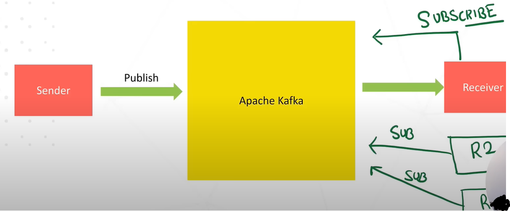

- Kafka - [Confluent](https://developer.confluent.io/what-is-apache-kafka/)
- Tutorial used for learning - [YT](https://youtu.be/ei6fK9StzMM?si=BfAGDuTIQPRxDFu1)
- Apache Kafka is like a communication system (messaging system) that helps different parts of a computer system exchange data by publishing and subscribing to topics (pub-sub model).
  - Apache Kafka is a MQ system that uses pub-sub model.
  - Sender publishes the data in Apache Kafka, so it is the publisher.
  - The Receivers that have subscribed, are the only receives the receive the data and are the consumers.
  - Multiple receivers can subscribe to a single topic and consume the same data.
  - The flow of data is called flow of stream.
  - 
- For storing data we use DB (less throughput) but for communication, we use MQs (e.g. Apache Kafkam, RabbitMQ, etc.) (more throughput).
- Kafka is a distributed system.
- We use Kafka for the below reasongs:
  - High throughput (high read-write)
  - Fault Tolerance (Replication. As Kafka is a distributed system, the data is stored replicated and stored in multiple nodes.)
  - Durable (As Kafka is a distributed system, so the data is stored in multiple nodes and that increases the durability)
  - Scalable
- Kafka Architecture: