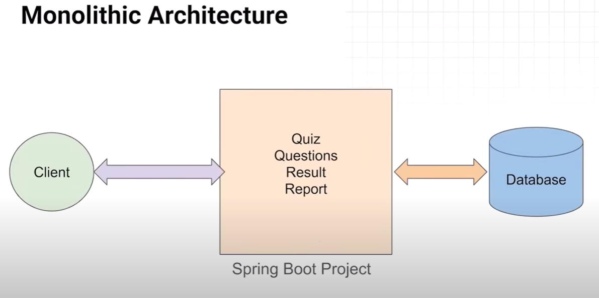
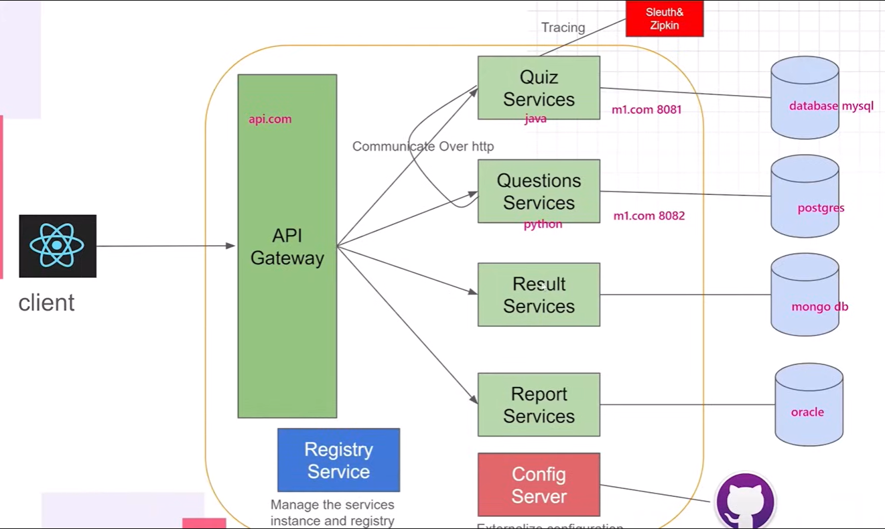

- Disadvantages of Monolithic Patter
  - Tight Coupling of services
    - If one service is down, other services also get affected
    - If one service is planned to redeploy, others also get affected
  - Scaling problem
  - Technology locking
  - Codebase become complex as project scale.
  - 

---
---
## Microservices Architecture:
- Software Design Pattern where software is composed of small independent services that communicate over well-defined APIs.
- 
  - Each service will have different individual projects and each of them can have different databases. They can even have different codebases.
  - Services will be deployed on the same server and host but on different ports.
  - Services can communicate between each other using *Communicate Over http* or *Messaging Queues* like *Apache Kafka*.
    - To do *Communicate Over http*, we can use different types of clients.
      - Feign Client (Spring Cloud)
      - Reactive Web Client (Asynchronous)
      - REST Client (Synchronous)
      - Rest Template (Deprecated)
  - We can have multiple services in our project, meaning there will be multiple domains. Now, for client to not get confused on which domain to call, client communicate with a service called API Gateway.
    - API Gateway in itself a micro-service.
    - Client will communicate with API Gateway for any request and API Gateway will redirect that request to other services.
    - API Gateway acts as a gatekeeper for external requests.
    - API Gateway helps in managing all the different domains of the services for different client requests.
  - Config Server: Externalize Configuration
    - We use this to externalize the configuration file (xml file, properties file or yml file).
    - Each service will fetch their configurations from here.
    - So, we can basically create a service that contains only configurations and rest of the service will ask it for their configurations.
    - So, it manages configurations for all the services.
    - Config Server can manage the data in two ways.
      - Locally put the configurations of the services in the server itself.
      - Put the configurations in a remote repo (Github, Gitlab, etc).
        - In this case, whenever a service needs it's configurations, config server pick it up from the remote repo by default.
        - This is also a micro-service.
    - Registry Service (Discovery Server):
      - To manage the multiple instances of the services, we use Registry Service.
      - How many services in the project, how many instances of the services, which domain is used by which service, Keep the info of all the instances in one place, when to use which instance, Load Balancing, etc.
      - In case an instance of a service is down, Registry Service redirects the request to another running instance of the same service.
      - We need to manage all the micro-services using the service registry.
      - This is also a micro-service.
      - Registry Service will act as a server and rest of the server will act as a client.
      - We can use the below services to create the server and client. Both of them are part of Spring Cloud project.
        - Eureka Server: Create the server
        - Eureka Client: Create the client
    - Sleuth & Zipkin:
      - This is used for centralized tracing & logging.
      - This is a distributed tracing.
      - Sleuth is provided by Spring Cloud and used for distributed tracing.
      - Zipkin is used to monitor the tracing logs (provides an interface).
  - It is recommended to use packages from Spring Cloud project in the microservices architecture.